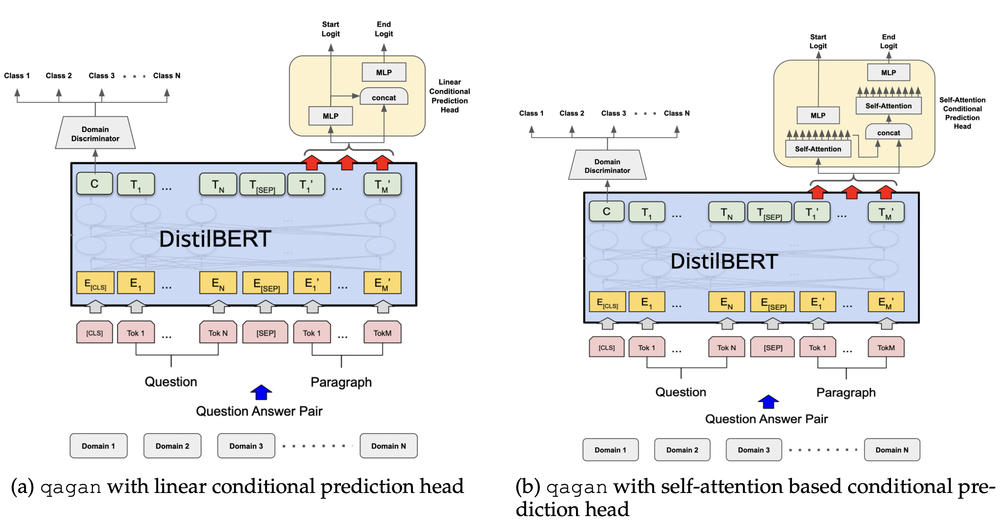
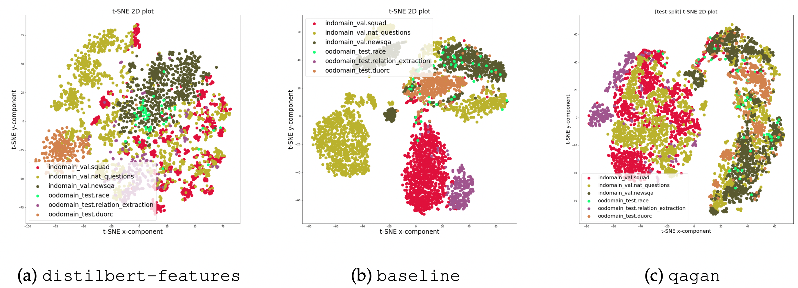

# QAGAN: Adversarial Approach To Learning Domain Invariant Language Features

This is the official implementation of [[**QAGAN**]](https://arxiv.org/abs/2206.12388)]

In this work, we explore adversarial training approach towards learning domain-invariant features so that language models can generalize well to out-of-domain datasets. We also inspect various other ways to boost our model performance including data augmentation by paraphrasing sentences, conditioning end of answer span prediction on the start word, and carefully designed annealing function.



We also dissect our model outputs and visualize the model hidden-states by projecting them onto a lower-dimensional space, and discover that our specific adversarial training approach indeed encourages the model to learn domain invariant embedding and bring them closer in the multi-dimensional space.



## Getting Started

### Datasets

- Download datasets: `cd datasets && sh download_data.sh`  
- Convert the dataset into SQuAD format: 
    - `in-domain train` dataset: 
        ```/bin/sh
        python datasets/process_data.py --input-path=datasets/indomain_train_mrqa --output-path=datasets/indomain_train
        ```    
    - `in-domain validation` dataset: 
        ```/bin/sh
        python datasets/process_data.py --input-path=datasets/indomain_val_mrqa --output-path=datasets/indomain_val
        ```    
    - `out-of-domain validation` dataset: 
        ```/bin/sh
        python datasets/process_data.py --input-path=datasets/oodomain_val_mrqa --output-path=datasets/oodomain_val
        ```   

### Setup, Training, and Validation
- Setup environment:
  ```/bin/sh
  cd environment && conda env create -f conda_env.yml
  conda activate qagan
  python -m ipykernel install --user --name qagan --display-name "qagan"
  cd ..
  ```

- Usage: 
    ```/bin/sh
    Usage: ./run_experiments.sh train {variant} {experiment_name}
           ./run_experiments.sh finetune {variant} {experiment_name} {pretrained_ckpt_path}
           ./run_experiments.sh evaluate {variant} {experiment_name}
           ./run_experiments.sh evaluate {test} {experiment_name}
    ```
- e.g:
    - Train a baseline MTL system with `./run_experiments.sh train qagan default`
    - Train a baseline MTL system with `./run_experiments.sh finetune qagan-finetune default save/qagan.default-01`
    - Evaluate the system on validation set, run `./run_experiments.sh evaluate qagan-finetune default`
    - Evaluate the system on test set with `./run_experiments.sh test qagan-finetune default`
- For submitting to leaderboard, upload the csv file generated in `save/{VARIANT}.{EXPERIMENT_NAME}-01` to the test leaderboard.
- To run all the experiments, run `sh experiments_launcher.sh`.  
- To perform data augmentation, run `python src/data_augmentation.py --domain="indomain_train" --datasets=HotpotQA,NaturalQuestions,NewsQA,SearchQA,SQuAD,TriviaQA --fast_metric=True`

## Citation

If you find our work useful in your research, please cite this as:

```
@misc{https://doi.org/10.48550/arxiv.2206.12388,
  doi = {10.48550/ARXIV.2206.12388},
  url = {https://arxiv.org/abs/2206.12388},
  author = {Shrivastava, Shubham and Wang, Kaiyue},
  keywords = {Computation and Language (cs.CL), FOS: Computer and information sciences, FOS: Computer and information sciences},
  title = {QAGAN: Adversarial Approach To Learning Domain Invariant Language Features},
  publisher = {arXiv},
  year = {2022},
  copyright = {arXiv.org perpetual, non-exclusive license}
}
```
