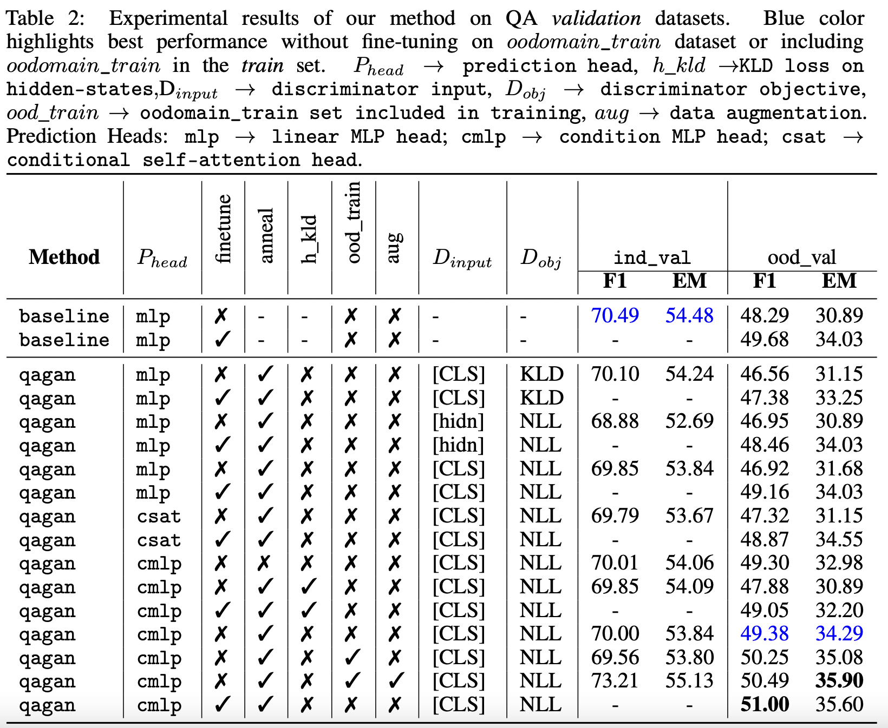
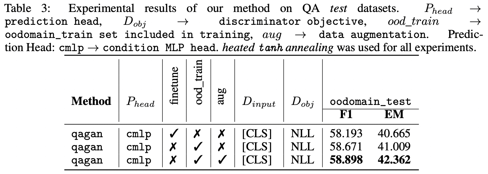

# QAGAN: Adversarial Approach To Learning Domain Invariant Language Features

## Getting Started

### Datasets

- Download datasets: `cd datasets && sh download_data.sh`  
- Convert the dataset into SQuAD format: 
    - `in-domain train` dataset: 
        ```/bin/sh
        python datasets/process_data.py --input-path=datasets/indomain_train_mrqa --output-path=datasets/indomain_train
        ```    
    - `in-domain validation` dataset: 
        ```/bin/sh
        python datasets/process_data.py --input-path=datasets/indomain_val_mrqa --output-path=datasets/indomain_val
        ```    
    - `out-of-domain validation` dataset: 
        ```/bin/sh
        python datasets/process_data.py --input-path=datasets/oodomain_val_mrqa --output-path=datasets/oodomain_val
        ```   

### Setup, Training, and Validation
- Setup environment with `cd environment && conda env create -f conda_env.yml`
- Usage: 
    ```/bin/sh
    Usage: ./run_experiments.sh train {variant} {experiment_name}
           ./run_experiments.sh finetune {variant} {experiment_name} {pretrained_ckpt_path}
           ./run_experiments.sh evaluate {variant} {experiment_name}
           ./run_experiments.sh evaluate {test} {experiment_name}
    ```
- e.g:
    - Train a baseline MTL system with `./run_experiments.sh train qagan default`
    - Train a baseline MTL system with `./run_experiments.sh finetune qagan-finetune default save/qagan.default-01`
    - Evaluate the system on validation set, run `./run_experiments.sh evaluate qagan-finetune default`
    - Evaluate the system on test set with `./run_experiments.sh test qagan-finetune default`
- For submitting to leaderboard, upload the csv file generated in `save/{VARIANT}.{EXPERIMENT_NAME}-01` to the test leaderboard.
- To run all the experiments, run `sh experiments_launcher.sh`.  
- To perform data augmentation, run `python src/data_augmentation.py --domain="indomain_train" --datasets=sHotpotQA,NaturalQuestions,NewsQA,SearchQA,SQuAD,TriviaQA --fast_metric=True`

## Quantitative Evaluation


